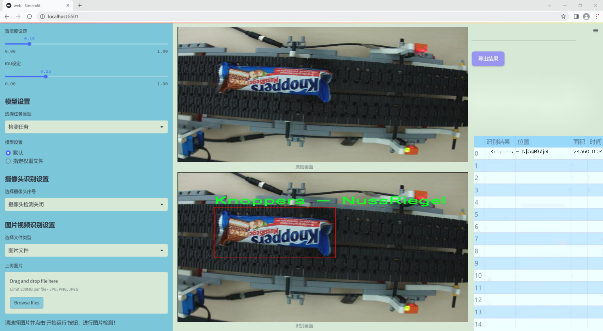
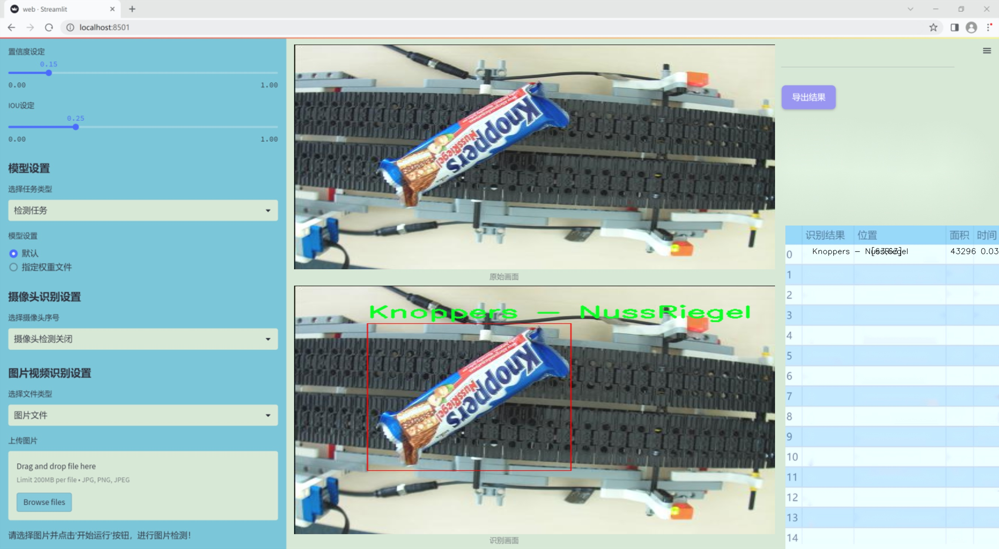
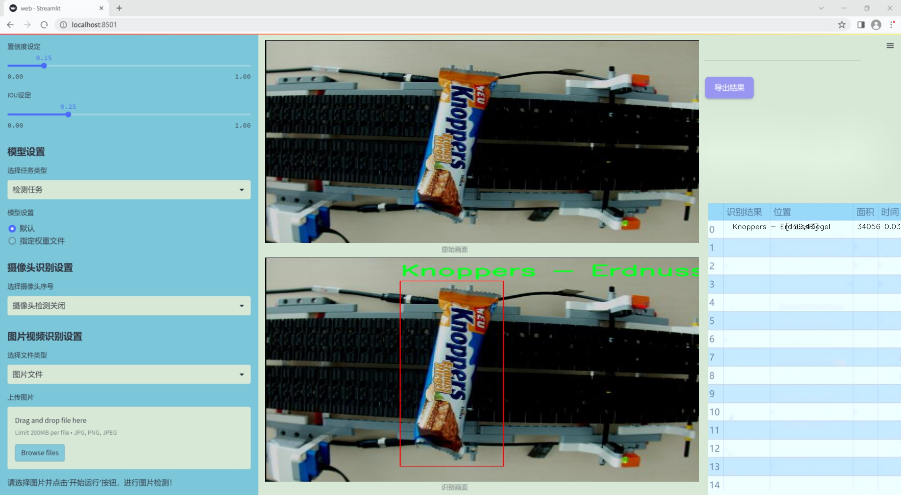
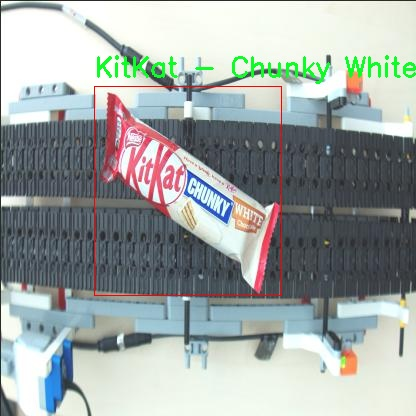
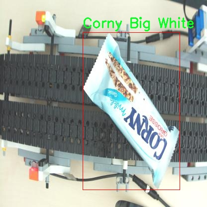
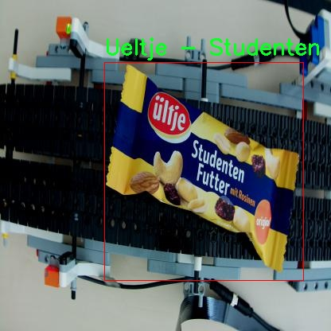
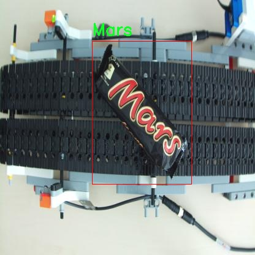

# 改进yolo11-Faster-EMA等200+全套创新点大全：流水线糖果类型检测系统源码＆数据集全套

### 1.图片效果展示







##### 项目来源 **[人工智能促进会 2024.11.03](https://kdocs.cn/l/cszuIiCKVNis)**

注意：由于项目一直在更新迭代，上面“1.图片效果展示”和“2.视频效果展示”展示的系统图片或者视频可能为老版本，新版本在老版本的基础上升级如下：（实际效果以升级的新版本为准）

  （1）适配了YOLOV11的“目标检测”模型和“实例分割”模型，通过加载相应的权重（.pt）文件即可自适应加载模型。

  （2）支持“图片识别”、“视频识别”、“摄像头实时识别”三种识别模式。

  （3）支持“图片识别”、“视频识别”、“摄像头实时识别”三种识别结果保存导出，解决手动导出（容易卡顿出现爆内存）存在的问题，识别完自动保存结果并导出到tempDir中。

  （4）支持Web前端系统中的标题、背景图等自定义修改。

  另外本项目提供训练的数据集和训练教程,暂不提供权重文件（best.pt）,需要您按照教程进行训练后实现图片演示和Web前端界面演示的效果。

### 2.视频效果展示

[2.1 视频效果展示](https://www.bilibili.com/video/BV1mbDEYYEbS/)

### 3.背景

研究背景与意义

随着现代社会的快速发展，食品工业的自动化和智能化水平不断提高，尤其是在糖果生产和包装领域，需求愈发旺盛。传统的人工检测方法不仅效率低下，而且容易受到人为因素的影响，导致检测结果的不准确性。为了解决这一问题，基于深度学习的计算机视觉技术逐渐成为糖果类型检测的有效解决方案。其中，YOLO（You Only Look Once）系列模型因其高效的实时检测能力而备受关注。YOLOv11作为该系列的最新版本，具有更强的特征提取能力和更快的推理速度，为糖果类型的自动化检测提供了良好的基础。

本研究旨在基于改进的YOLOv11模型，构建一个高效的流水线糖果类型检测系统。我们使用的糖果数据集包含2600张图像，涵盖了多种糖果类型，包括Balisto gruen、Corny Big Schoko-Banane、Hanuta、Haribo - Tropical Fruit等多达16个类别。这些类别的多样性为模型的训练和测试提供了丰富的样本，有助于提高检测的准确性和鲁棒性。通过对YOLOv11模型的改进，我们期望能够提升其在复杂背景下的检测性能，从而实现对不同糖果类型的快速、准确识别。

本研究的意义在于推动糖果生产线的智能化升级，提升生产效率和产品质量。通过实现自动化检测，不仅可以降低人工成本，还能减少人为错误，提高生产线的整体运作效率。此外，准确的糖果类型检测系统还将为后续的产品追溯、库存管理等提供有力支持，促进食品安全和消费者信任的提升。因此，本项目不仅具有重要的学术价值，也具备广泛的应用前景，对推动食品工业的智能化发展具有重要意义。

### 4.数据集信息展示

##### 4.1 本项目数据集详细数据（类别数＆类别名）

nc: 18
names: ['Balisto gruen', 'Corny Big Schoko-Banane', 'Corny Big White', 'Hanuta', 'Haribo - Tropical Fruit', 'KitKat', 'KitKat - Chunky White', 'Knoppers - ErdnussRiegel', 'Knoppers - NussRiegel', 'M-M - Peanut', 'Mars', 'Milka - Tender', 'MilkyWay - CripyRolls', 'Pickup - Choco', 'Pickup - Choco - Milk', 'Snickers', 'Twix', 'Ueltje - Studenten Futter']


该项目为【目标检测】数据集，请在【训练教程和Web端加载模型教程（第三步）】这一步的时候按照【目标检测】部分的教程来训练

##### 4.2 本项目数据集信息介绍

本项目数据集信息介绍。本研究旨在改进YOLOv11的流水线糖果类型检测系统，所使用的数据集名为“Sweets”。该数据集包含18个不同的糖果类别，旨在为模型提供丰富的训练样本，以提高其在实际应用中的识别精度和鲁棒性。具体类别包括：Balisto gruen、Corny Big Schoko-Banane、Corny Big White、Hanuta、Haribo - Tropical Fruit、KitKat、KitKat - Chunky White、Knoppers - ErdnussRiegel、Knoppers - NussRiegel、M-M - Peanut、Mars、Milka - Tender、MilkyWay - CripyRolls、Pickup - Choco、Pickup - Choco - Milk、Snickers、Twix以及Ueltje - Studenten Futter。

每个类别的选择均基于市场上流行的糖果品牌，确保数据集的代表性和多样性。这些糖果不仅在外观上各具特色，而且在包装、颜色和形状上也存在显著差异，为模型的训练提供了良好的基础。数据集中的图像经过精心挑选和标注，确保每个样本都能准确反映出其对应的类别特征。通过使用该数据集，研究团队希望能够提升YOLOv11在流水线环境中的实时检测能力，使其能够快速、准确地识别不同类型的糖果，从而提高生产效率和产品质量。

此外，数据集的构建还考虑到了实际应用中的各种挑战，如光照变化、背景干扰和糖果的排列方式等。这些因素的综合考虑使得“Sweets”数据集不仅适用于模型的初步训练，也为后续的优化和调试提供了重要的支持。通过对该数据集的深入分析和利用，研究团队期待能够实现糖果检测系统的性能突破，为相关行业带来更高的自动化水平和经济效益。










### 5.全套项目环境部署视频教程（零基础手把手教学）

[5.1 所需软件PyCharm和Anaconda安装教程（第一步）](https://www.bilibili.com/video/BV1BoC1YCEKi/?spm_id_from=333.999.0.0&vd_source=bc9aec86d164b67a7004b996143742dc)


[5.2 安装Python虚拟环境创建和依赖库安装视频教程（第二步）](https://www.bilibili.com/video/BV1ZoC1YCEBw?spm_id_from=333.788.videopod.sections&vd_source=bc9aec86d164b67a7004b996143742dc)

### 6.改进YOLOv11训练教程和Web_UI前端加载模型教程（零基础手把手教学）

[6.1 改进YOLOv11训练教程和Web_UI前端加载模型教程（第三步）](https://www.bilibili.com/video/BV1BoC1YCEhR?spm_id_from=333.788.videopod.sections&vd_source=bc9aec86d164b67a7004b996143742dc)


按照上面的训练视频教程链接加载项目提供的数据集，运行train.py即可开始训练



     Epoch   gpu_mem       box       obj       cls    labels  img_size
     1/200     20.8G   0.01576   0.01955  0.007536        22      1280: 100%|██████████| 849/849 [14:42<00:00,  1.04s/it]
               Class     Images     Labels          P          R     mAP@.5 mAP@.5:.95: 100%|██████████| 213/213 [01:14<00:00,  2.87it/s]
                 all       3395      17314      0.994      0.957      0.0957      0.0843

     Epoch   gpu_mem       box       obj       cls    labels  img_size
     2/200     20.8G   0.01578   0.01923  0.007006        22      1280: 100%|██████████| 849/849 [14:44<00:00,  1.04s/it]
               Class     Images     Labels          P          R     mAP@.5 mAP@.5:.95: 100%|██████████| 213/213 [01:12<00:00,  2.95it/s]
                 all       3395      17314      0.996      0.956      0.0957      0.0845

     Epoch   gpu_mem       box       obj       cls    labels  img_size
     3/200     20.8G   0.01561    0.0191  0.006895        27      1280: 100%|██████████| 849/849 [10:56<00:00,  1.29it/s]
               Class     Images     Labels          P          R     mAP@.5 mAP@.5:.95: 100%|███████   | 187/213 [00:52<00:00,  4.04it/s]
                 all       3395      17314      0.996      0.957      0.0957      0.0845


###### [项目数据集下载链接](https://kdocs.cn/l/cszuIiCKVNis)

### 7.原始YOLOv11算法讲解


YOLO11 是 Ultralytics YOLO 系列的最新版本，结合了尖端的准确性、速度和效率，用于目标检测、分割、分类、定向边界框和姿态估计。与
YOLOv8 相比，它具有更少的参数和更好的结果，不难预见，YOLO11 在边缘设备上更高效、更快，将频繁出现在计算机视觉领域的最先进技术（SOTA）中。


**主要特点**

  * **增强的特征提取：**YOLO11 使用改进的主干和颈部架构来增强特征提取，以实现更精确的目标检测和复杂任务的性能。

  * **针对效率和速度优化：**精细的架构设计和优化的训练流程在保持准确性和性能之间最佳平衡的同时，提供更快的处理速度。

  * **更少的参数，更高的准确度：**YOLO11m 在 COCO 数据集上实现了比 YOLOv8m 更高的 mAP，参数减少了 22%，提高了计算效率，同时不牺牲准确度。

  * **跨环境的适应性：**YOLO11 可以无缝部署在边缘设备、云平台和配备 NVIDIA GPU 的系统上，确保最大的灵活性。

  * **支持广泛的任务范围：**YOLO11 支持各种计算机视觉任务，如目标检测、实例分割、图像分类、姿态估计和定向目标检测（OBB）。


### 8.200+种全套改进YOLOV11创新点原理讲解

#### 8.1 200+种全套改进YOLOV11创新点原理讲解大全

由于篇幅限制，每个创新点的具体原理讲解就不全部展开，具体见下列网址中的改进模块对应项目的技术原理博客网址【Blog】（创新点均为模块化搭建，原理适配YOLOv5~YOLOv11等各种版本）

[改进模块技术原理博客【Blog】网址链接](https://gitee.com/qunmasj/good)


#### 8.2 精选部分改进YOLOV11创新点原理讲解

###### 这里节选部分改进创新点展开原理讲解(完整的改进原理见上图和[改进模块技术原理博客链接](https://gitee.com/qunmasj/good)【如果此小节的图加载失败可以通过CSDN或者Github搜索该博客的标题访问原始博客，原始博客图片显示正常】



### 视觉transformer(ViT)简介
视觉transformer(ViT)最近在各种计算机视觉任务中证明了巨大的成功，并受到了相当多的关注。与卷积神经网络(CNNs)相比，ViT具有更强的全局信息捕获能力和远程交互能力，表现出优于CNNs的准确性，特别是在扩大训练数据大小和模型大小时[An image is worth 16x16 words: Transformers for image recognition at scale,Coatnet]。

尽管ViT在低分辨率和高计算领域取得了巨大成功，但在高分辨率和低计算场景下，ViT仍不如cnn。例如，下图(左)比较了COCO数据集上当前基于cnn和基于vit的一级检测器。基于vit的检测器(160G mac)和基于cnn的检测器(6G mac)之间的效率差距超过一个数量级。这阻碍了在边缘设备的实时高分辨率视觉应用程序上部署ViT。


左图:现有的基于vit的一级检测器在实时目标检测方面仍然不如当前基于cnn的一级检测器，需要的计算量多出一个数量级。本文引入了第一个基于vit的实时对象检测器来弥补这一差距。在COCO上，efficientvit的AP比efficientdet高3.8，而mac较低。与YoloX相比，efficient ViT节省67.2%的计算成本，同时提供更高的AP。

中:随着输入分辨率的增加，计算成本呈二次增长，无法有效处理高分辨率的视觉应用。

右图:高分辨率对图像分割很重要。当输入分辨率从1024x2048降低到512x1024时，MobileNetV2的mIoU减少12% (8.5 mIoU)。在不提高分辨率的情况下，只提高模型尺寸是无法缩小性能差距的。

ViT的根本计算瓶颈是softmax注意模块，其计算成本随输入分辨率的增加呈二次增长。例如，如上图(中)所示，随着输入分辨率的增加，vit- small[Pytorch image models. https://github.com/rwightman/ pytorch-image-models]的计算成本迅速显著大于ResNet-152的计算成本。

解决这个问题的一个直接方法是降低输入分辨率。然而，高分辨率的视觉识别在许多现实世界的计算机视觉应用中是必不可少的，如自动驾驶，医疗图像处理等。当输入分辨率降低时，图像中的小物体和精细细节会消失，导致目标检测和语义分割性能显著下降。

上图(右)显示了在cityscape数据集上不同输入分辨率和宽度乘法器下MobileNetV2的性能。例如，将输入分辨率从1024x2048降低到512x1024会使cityscape的性能降低12% (8.5 mIoU)。即使是3.6倍高的mac，只放大模型尺寸而不增加分辨率也无法弥补这一性能损失。

除了降低分辨率外，另一种代表性的方法是限制softmax注意，方法是将其范围限制在固定大小的局部窗口内[Swin transformer,Swin transformer v2]或降低键/值张量的维数[Pyramid vision transformer,Segformer]。然而，它损害了ViT的非局部注意能力，降低了全局接受域(ViT最重要的优点)，使得ViT与大内核cnn的区别更小[A convnet for the 2020s,Scaling up your kernels to 31x31: Revisiting large kernel design in cnns,Lite pose: Efficient architecture design for 2d human pose estimation]。

本文介绍了一个有效的ViT体系结构，以解决这些挑战。发现没有必要坚持softmax注意力。本文建议用线性注意[Transformers are rnns: Fast autoregressive transformers with linear attention]代替softmax注意。

线性注意的关键好处是，它保持了完整的n 2 n^2n 2
 注意映射，就像softmax注意。同时，它利用矩阵乘法的联想特性，避免显式计算完整的注意映射，同时保持相同的功能。因此，它保持了softmax注意力的全局特征提取能力，且计算复杂度仅为线性。线性注意的另一个关键优点是它避免了softmax，这使得它在移动设备上更有效(下图左)。


左图:线性注意比类似mac下的softmax注意快3.3-4.5倍，这是因为去掉了硬件效率不高的softmax功能。延迟是在Qualcomm Snapdragon 855 CPU和TensorFlow-Lite上测量的。本文增加线性注意的头部数量，以确保它具有与softmax注意相似的mac。

中:然而，如果没有softmax注意中使用的非线性注意评分归一化，线性注意无法有效集中其注意分布，削弱了其局部特征提取能力。后文提供了可视化。

右图:本文用深度卷积增强线性注意，以解决线性注意的局限性。深度卷积可以有效地捕捉局部特征，而线性注意可以专注于捕捉全局信息。增强的线性注意在保持线性注意的效率和简单性的同时，表现出在各种视觉任务上的强大表现(图4)。

然而，直接应用线性注意也有缺点。以往的研究表明线性注意和softmax注意之间存在显著的性能差距(下图中间)。


左:高通骁龙855上的精度和延迟权衡。效率vit比效率网快3倍，精度更高。中:ImageNet上softmax注意与线性注意的比较。在相同的计算条件下，本文观察到softmax注意与线性注意之间存在显著的精度差距。而深度卷积增强模型后，线性注意的精度有明显提高。

相比之下，softmax注意的精度变化不大。在相同MAC约束下，增强线性注意比增强软最大注意提高了0.3%的精度。右图:与增强的softmax注意相比，增强的线性注意硬件效率更高，随着分辨率的增加，延迟增长更慢。

深入研究线性注意和softmax注意的详细公式，一个关键的区别是线性注意缺乏非线性注意评分归一化方案。这使得线性注意无法有效地将注意力分布集中在局部模式产生的高注意分数上，从而削弱了其局部特征提取能力。

本文认为这是线性注意的主要限制，使其性能不如softmax注意。本文提出了一个简单而有效的解决方案来解决这一限制，同时保持线性注意在低复杂度和低硬件延迟方面的优势。具体来说，本文建议通过在每个FFN层中插入额外的深度卷积来增强线性注意。因此，本文不需要依赖线性注意进行局部特征提取，避免了线性注意在捕捉局部特征方面的不足，并利用了线性注意在捕捉全局特征方面的优势。

本文广泛评估了efficient vit在低计算预算下对各种视觉任务的有效性，包括COCO对象检测、城市景观语义分割和ImageNet分类。本文想要突出高效的主干设计，所以没有包括任何正交的附加技术(例如，知识蒸馏，神经架构搜索)。尽管如此，在COCO val2017上，efficientvit的AP比efficientdet - d1高2.4倍，同时节省27.9%的计算成本。在cityscape上，efficientvit提供了比SegFormer高2.5个mIoU，同时降低了69.6%的计算成本。在ImageNet上，efficientvit在584M mac上实现了79.7%的top1精度，优于efficientnet - b1的精度，同时节省了16.6%的计算成本。

与现有的以减少参数大小或mac为目标的移动ViT模型[Mobile-former,Mobilevit,NASVit]不同，本文的目标是减少移动设备上的延迟。本文的模型不涉及复杂的依赖或硬件低效操作。因此，本文减少的计算成本可以很容易地转化为移动设备上的延迟减少。

在高通骁龙855 CPU上，efficient vit运行速度比efficientnet快3倍，同时提供更高的ImageNet精度。本文的代码和预训练的模型将在出版后向公众发布。

### Efficient Vision Transformer.
提高ViT的效率对于在资源受限的边缘平台上部署ViT至关重要，如手机、物联网设备等。尽管ViT在高计算区域提供了令人印象深刻的性能，但在针对低计算区域时，它通常不如以前高效的cnn[Efficientnet, mobilenetv3,Once for all: Train one network and specialize it for efficient deployment]。为了缩小差距，MobileViT建议结合CNN和ViT的长处，使用transformer将卷积中的局部处理替换为全局处理。MobileFormer提出了在MobileNet和Transformer之间建立双向桥以实现特征融合的并行化。NASViT提出利用神经架构搜索来搜索高效的ViT架构。

这些模型在ImageNet上提供了极具竞争力的准确性和效率的权衡。然而，它们并不适合高分辨率的视觉任务，因为它们仍然依赖于softmax注意力。


在本节中，本文首先回顾了自然语言处理中的线性注意，并讨论了它的优缺点。接下来，本文介绍了一个简单而有效的解决方案来克服线性注意的局限性。最后，给出了efficient vit的详细架构。

 为可学习投影矩阵。Oi表示矩阵O的第i行。Sim(·，·)为相似度函数。

虽然softmax注意力在视觉和NLP方面非常成功，但它并不是唯一的选择。例如，线性注意提出了如下相似度函数:


其中，φ(·)为核函数。在本工作中，本文选择了ReLU作为内核函数，因为它对硬件来说是友好的。当Sim(Q, K) = φ(Q)φ(K)T时，式(1)可改写为:


线性注意的一个关键优点是，它允许利用矩阵乘法的结合律，在不改变功能的情况下，将计算复杂度从二次型降低到线性型:


除了线性复杂度之外，线性注意的另一个关键优点是它不涉及注意模块中的softmax。Softmax在硬件上效率非常低。避免它可以显著减少延迟。例如，下图(左)显示了softmax注意和线性注意之间的延迟比较。在类似的mac上，线性注意力比移动设备上的softmax注意力要快得多。


#### EfficientViT
Enhancing Linear Attention with Depthwise Convolution

虽然线性注意在计算复杂度和硬件延迟方面优于softmax注意，但线性注意也有局限性。以往的研究[\[Luna: Linear unified nested attention,Random feature attention,Combiner: Full attention transformer with sparse computation cost,cosformer: Rethinking softmax in attention\]](https://afdian.net/item/602b9612927111ee9ec55254001e7c00)表明，在NLP中线性注意和softmax注意之间通常存在显著的性能差距。对于视觉任务，之前的研究[Visual correspondence hallucination,Quadtree attention for vision transformers]也表明线性注意不如softmax注意。在本文的实验中，本文也有类似的观察结果(图中)。


本文对这一假设提出了质疑，认为线性注意的低劣性能主要是由于局部特征提取能力的丧失。如果没有在softmax注意中使用的非线性评分归一化，线性注意很难像softmax注意那样集中其注意分布。下图(中间)提供了这种差异的示例。


在相同的原始注意力得分下，使用softmax比不使用softmax更能集中注意力。因此，线性注意不能有效地聚焦于局部模式产生的高注意分数(下图)，削弱了其局部特征提取能力。


注意图的可视化显示了线性注意的局限性。通过非线性注意归一化，softmax注意可以产生清晰的注意分布，如中间行所示。相比之下，线性注意的分布相对平滑，使得线性注意在捕捉局部细节方面的能力较弱，造成了显著的精度损失。本文通过深度卷积增强线性注意来解决这一限制，并有效提高了准确性。

介绍了一个简单而有效的解决方案来解决这个限制。本文的想法是用卷积增强线性注意，这在局部特征提取中是非常有效的。这样，本文就不需要依赖于线性注意来捕捉局部特征，而可以专注于全局特征提取。具体来说，为了保持线性注意的效率和简单性，本文建议在每个FFN层中插入一个深度卷积，这样计算开销很小，同时极大地提高了线性注意的局部特征提取能力。

#### Building Block

下图(右)展示了增强线性注意的详细架构，它包括一个线性注意层和一个FFN层，在FFN的中间插入深度卷积。


与之前的方法[Swin transformer,Coatnet]不同，本文在efficientvit中没有使用相对位置偏差。相对位置偏差虽然可以改善模型的性能，但它使模型容易受到分辨率变化[Segformer]的影响。多分辨率训练或新分辨率下的测试在检测和分割中很常见。去除相对位置偏差使高效率vit对输入分辨率更加灵活。

与之前低计算CNNs[Mobilenetv2,mobilenetv3]的设计不同，本文为下采样块添加了额外的下采样快捷方式。每个下采样快捷方式由一个平均池和一个1x1卷积组成。在本文的实验中，这些额外的下采样快捷方式可以稳定训练效率，提高性能。

#### Macro Architecture

下图说明了efficientvit的宏观体系结构。它由输入 stem 和4级组成。最近的研究[Coatnet,Levit,Early convolutions help transformers see better]表明在早期阶段使用卷积对ViT更好。本文遵循这个设计，在第三阶段开始使用增强的线性注意。


EfficientViT宏观架构。本文从第三阶段开始使用增强的线性注意。P2、P3和P4形成了一个金字塔特征图，用于检测和分割。P4用于分类。

为了突出高效的主干本身，本文对MBConv和FFN使用相同的扩展比e (e = 4)保持超参数简单，对所有深度卷积使用相同的内核大小k(除了输入stem)，对所有层使用相同的激活函数(hard swish)。

P2、P3和P4表示阶段2、3和4的输出，形成了特征图的金字塔。本文按照惯例将P2、P3和P4送至检测头。本文使用Yolov8进行检测。为了分割，本文融合了P2和P4。融合特征被馈送到一个轻量级头，包括几个卷积层，遵循Fast-SCNN。为了分类，本文将P4输入到轻量级头部，与MobileNetV3相同。


### 9.系统功能展示

图9.1.系统支持检测结果表格显示

  图9.2.系统支持置信度和IOU阈值手动调节

  图9.3.系统支持自定义加载权重文件best.pt(需要你通过步骤5中训练获得)

  图9.4.系统支持摄像头实时识别

  图9.5.系统支持图片识别

  图9.6.系统支持视频识别

  图9.7.系统支持识别结果文件自动保存

  图9.8.系统支持Excel导出检测结果数据


### 10. YOLOv11核心改进源码讲解

#### 10.1 CSwomTramsformer.py

以下是经过简化和注释的 CSWin Transformer 代码，保留了最核心的部分，并对每个关键部分进行了详细的中文注释。

```python
import torch
import torch.nn as nn
import numpy as np

class Mlp(nn.Module):
    """多层感知机（MLP）模块"""
    def __init__(self, in_features, hidden_features=None, out_features=None, act_layer=nn.GELU, drop=0.):
        super().__init__()
        out_features = out_features or in_features  # 输出特征数
        hidden_features = hidden_features or in_features  # 隐藏层特征数
        self.fc1 = nn.Linear(in_features, hidden_features)  # 第一层线性变换
        self.act = act_layer()  # 激活函数
        self.fc2 = nn.Linear(hidden_features, out_features)  # 第二层线性变换
        self.drop = nn.Dropout(drop)  # Dropout层

    def forward(self, x):
        """前向传播"""
        x = self.fc1(x)  # 线性变换
        x = self.act(x)  # 激活
        x = self.drop(x)  # Dropout
        x = self.fc2(x)  # 线性变换
        x = self.drop(x)  # Dropout
        return x

class LePEAttention(nn.Module):
    """局部增强注意力模块"""
    def __init__(self, dim, resolution, num_heads, split_size=7, attn_drop=0.):
        super().__init__()
        self.dim = dim  # 输入特征维度
        self.resolution = resolution  # 输入分辨率
        self.split_size = split_size  # 分割大小
        self.num_heads = num_heads  # 注意力头数
        self.scale = (dim // num_heads) ** -0.5  # 缩放因子
        self.get_v = nn.Conv2d(dim, dim, kernel_size=3, stride=1, padding=1, groups=dim)  # 卷积层用于获取v

    def im2cswin(self, x):
        """将输入张量转换为窗口形式"""
        B, N, C = x.shape
        H = W = int(np.sqrt(N))  # 计算高度和宽度
        x = x.transpose(-2, -1).contiguous().view(B, C, H, W)  # 转换形状
        # 进一步处理以获得窗口
        x = img2windows(x, self.split_size, self.split_size)
        return x

    def forward(self, qkv):
        """前向传播"""
        q, k, v = qkv  # 分别获取q, k, v
        q = self.im2cswin(q)  # 将q转换为窗口形式
        k = self.im2cswin(k)  # 将k转换为窗口形式
        # 计算注意力
        attn = (q @ k.transpose(-2, -1)) * self.scale  # 计算注意力分数
        attn = nn.functional.softmax(attn, dim=-1)  # softmax归一化
        x = attn @ v  # 加权求和
        return x

class CSWinBlock(nn.Module):
    """CSWin Transformer的基本块"""
    def __init__(self, dim, num_heads, split_size=7):
        super().__init__()
        self.qkv = nn.Linear(dim, dim * 3)  # 线性变换用于生成q, k, v
        self.attn = LePEAttention(dim, resolution=split_size, num_heads=num_heads)  # 注意力模块
        self.mlp = Mlp(in_features=dim, hidden_features=dim * 4)  # MLP模块

    def forward(self, x):
        """前向传播"""
        qkv = self.qkv(x).reshape(x.shape[0], -1, 3, x.shape[2]).permute(2, 0, 1, 3)  # 生成qkv
        x = self.attn(qkv)  # 通过注意力模块
        x = x + self.mlp(x)  # 添加MLP的输出
        return x

class CSWinTransformer(nn.Module):
    """CSWin Transformer模型"""
    def __init__(self, img_size=640, in_chans=3, num_classes=1000):
        super().__init__()
        self.stage1_conv_embed = nn.Sequential(
            nn.Conv2d(in_chans, 96, kernel_size=7, stride=4, padding=2),  # 输入卷积层
            nn.LayerNorm(96)  # 归一化层
        )
        self.stage1 = nn.ModuleList([CSWinBlock(dim=96, num_heads=12) for _ in range(2)])  # 第一阶段的多个CSWinBlock

    def forward(self, x):
        """前向传播"""
        x = self.stage1_conv_embed(x)  # 卷积嵌入
        for blk in self.stage1:
            x = blk(x)  # 通过每个块
        return x

# 示例用法
if __name__ == '__main__':
    inputs = torch.randn((1, 3, 640, 640))  # 输入示例
    model = CSWinTransformer()  # 创建模型
    res = model(inputs)  # 前向传播
    print(res.size())  # 输出结果的尺寸
```

### 主要模块说明：
1. **Mlp**：实现了一个简单的多层感知机，包含两个线性层和激活函数。
2. **LePEAttention**：实现了局部增强注意力机制，负责计算注意力分数并生成加权输出。
3. **CSWinBlock**：构成CSWin Transformer的基本单元，包含注意力机制和MLP。
4. **CSWinTransformer**：整体模型，包含输入卷积层和多个CSWinBlock。

以上代码保留了模型的核心结构，并对每个部分进行了详细的中文注释，以便于理解。

该文件实现了一个名为CSWin Transformer的视觉变换器模型，主要用于图像分类任务。该模型由微软公司开发，具有多个变体（如CSWin_tiny、CSWin_small、CSWin_base和CSWin_large），以适应不同的计算资源和任务需求。

文件首先导入了必要的库，包括PyTorch及其神经网络模块、图像处理模块以及一些辅助函数。接着定义了几个核心组件。

Mlp类实现了一个多层感知机（MLP），包含两个线性层和一个激活函数（默认为GELU），用于在特征维度上进行非线性变换。LePEAttention类实现了一个改进的自注意力机制，使用了局部增强的注意力（LePE），通过将输入图像分割成窗口来计算注意力权重。该类的构造函数中定义了输入维度、分辨率、头数等参数，并在前向传播中计算查询、键、值的注意力。

CSWinBlock类则是CSWin Transformer的基本构建块，包含了自注意力层和MLP层，并使用了残差连接和层归一化。它根据输入的分辨率和头数来设置不同的注意力层。

接下来，文件定义了img2windows和windows2img两个辅助函数，用于在图像和窗口之间进行转换。Merge_Block类用于在不同阶段之间合并特征，通常通过卷积操作来降低特征图的分辨率。

CSWinTransformer类是整个模型的主体，负责构建不同的阶段（stage），每个阶段由多个CSWinBlock组成。模型的输入首先通过一个卷积层进行嵌入，然后经过多个阶段的处理，每个阶段都可能包含特征合并和不同的注意力机制。模型的前向传播函数会返回每个阶段的特征。

文件中还定义了一些辅助函数，如_conv_filter和update_weight，用于处理模型权重的加载和更新。最后，提供了四个函数（CSWin_tiny、CSWin_small、CSWin_base、CSWin_large）用于创建不同规模的CSWin Transformer模型，并可选择加载预训练权重。

在文件的最后部分，包含了一个测试示例，生成随机输入并通过不同规模的模型进行前向传播，输出每个模型的特征图尺寸。这部分代码可以用于验证模型的正确性和性能。

#### 10.2 shiftwise_conv.py

以下是经过简化和注释的核心代码部分：

```python
import math
import torch
import torch.nn as nn
import torch.nn.functional as F

def get_conv2d(in_channels, out_channels, kernel_size, stride, padding, dilation, groups, bias):
    # 创建一个2D卷积层
    return nn.Conv2d(
        in_channels, out_channels, kernel_size, stride, padding, dilation, groups, bias
    )

def get_bn(channels):
    # 创建一个批归一化层
    return nn.BatchNorm2d(channels)

class Mask(nn.Module):
    def __init__(self, size):
        super().__init__()
        # 初始化一个可学习的权重参数
        self.weight = torch.nn.Parameter(data=torch.Tensor(*size), requires_grad=True)
        self.weight.data.uniform_(-1, 1)  # 权重初始化为[-1, 1]之间的均匀分布

    def forward(self, x):
        # 通过sigmoid函数对权重进行归一化，然后与输入相乘
        w = torch.sigmoid(self.weight)
        masked_wt = w.mul(x)
        return masked_wt

class ReparamLargeKernelConv(nn.Module):
    def __init__(self, in_channels, out_channels, kernel_size, small_kernel=5, stride=1, groups=1, small_kernel_merged=False, Decom=True, bn=True):
        super(ReparamLargeKernelConv, self).__init__()
        self.kernel_size = kernel_size
        self.small_kernel = small_kernel
        self.Decom = Decom
        padding = kernel_size // 2  # 计算填充大小
        
        # 如果小卷积核合并为大卷积核
        if small_kernel_merged:
            self.lkb_reparam = get_conv2d(
                in_channels=in_channels,
                out_channels=out_channels,
                kernel_size=kernel_size,
                stride=stride,
                padding=padding,
                dilation=1,
                groups=groups,
                bias=True,
            )
        else:
            if self.Decom:
                # 使用小卷积和大卷积的组合
                self.LoRA = conv_bn(
                    in_channels=in_channels,
                    out_channels=out_channels,
                    kernel_size=(kernel_size, small_kernel),
                    stride=stride,
                    padding=padding,
                    groups=groups,
                    bn=bn
                )
            else:
                # 仅使用大卷积
                self.lkb_origin = conv_bn(
                    in_channels=in_channels,
                    out_channels=out_channels,
                    kernel_size=kernel_size,
                    stride=stride,
                    padding=padding,
                    groups=groups,
                    bn=bn,
                )

            # 如果存在小卷积核
            if (small_kernel is not None) and small_kernel < kernel_size:
                self.small_conv = conv_bn(
                    in_channels=in_channels,
                    out_channels=out_channels,
                    kernel_size=small_kernel,
                    stride=stride,
                    padding=small_kernel // 2,
                    groups=groups,
                    bn=bn,
                )
        
        self.bn = get_bn(out_channels)  # 批归一化层
        self.act = nn.SiLU()  # 激活函数

    def forward(self, inputs):
        # 前向传播
        if hasattr(self, "lkb_reparam"):
            out = self.lkb_reparam(inputs)
        elif self.Decom:
            out = self.LoRA(inputs)
            if hasattr(self, "small_conv"):
                out += self.small_conv(inputs)
        else:
            out = self.lkb_origin(inputs)
            if hasattr(self, "small_conv"):
                out += self.small_conv(inputs)
        return self.act(self.bn(out))  # 返回经过激活和归一化的输出

    def get_equivalent_kernel_bias(self):
        # 获取等效的卷积核和偏置
        eq_k, eq_b = fuse_bn(self.lkb_origin.conv, self.lkb_origin.bn)
        if hasattr(self, "small_conv"):
            small_k, small_b = fuse_bn(self.small_conv.conv, self.small_conv.bn)
            eq_b += small_b
            eq_k += nn.functional.pad(small_k, [(self.kernel_size - self.small_kernel) // 2] * 4)
        return eq_k, eq_b

    def switch_to_deploy(self):
        # 切换到部署模式，使用等效卷积核和偏置
        if hasattr(self, 'lkb_origin'):
            eq_k, eq_b = self.get_equivalent_kernel_bias()
            self.lkb_reparam = get_conv2d(
                in_channels=self.lkb_origin.conv.in_channels,
                out_channels=self.lkb_origin.conv.out_channels,
                kernel_size=self.lkb_origin.conv.kernel_size,
                stride=self.lkb_origin.conv.stride,
                padding=self.lkb_origin.conv.padding,
                dilation=self.lkb_origin.conv.dilation,
                groups=self.lkb_origin.conv.groups,
                bias=True,
            )
            self.lkb_reparam.weight.data = eq_k
            self.lkb_reparam.bias.data = eq_b
            self.__delattr__("lkb_origin")
            if hasattr(self, "small_conv"):
                self.__delattr__("small_conv")
```

### 代码说明：
1. **get_conv2d**: 创建一个2D卷积层。
2. **get_bn**: 创建一个批归一化层。
3. **Mask**: 一个自定义的模块，用于生成可学习的权重并应用于输入。
4. **ReparamLargeKernelConv**: 自定义卷积层，支持大卷积核和小卷积核的组合。
   - `__init__`: 初始化卷积层和相关参数。
   - `forward`: 定义前向传播过程。
   - `get_equivalent_kernel_bias`: 获取等效的卷积核和偏置，用于模型部署。
   - `switch_to_deploy`: 切换到部署模式，使用等效卷积核和偏置。

这个程序文件 `shiftwise_conv.py` 实现了一个用于深度学习的卷积神经网络模块，主要是针对大卷积核的重参数化和小卷积核的组合。文件中定义了多个类和函数，主要包括卷积操作、批归一化、以及自定义的卷积层。

首先，文件中导入了必要的库，包括 `torch` 和 `torch.nn`，这些是 PyTorch 框架的核心组件。接着，定义了一个 `get_conv2d` 函数，用于创建一个标准的二维卷积层，并根据输入参数设置相应的卷积核大小、步幅、填充等。

接下来，定义了一个 `Mask` 类，它是一个自定义的模块，包含一个可学习的权重参数。该模块的前向传播过程通过对输入进行 Sigmoid 激活后与输入进行逐元素相乘，生成一个加权后的输出。

`conv_bn_ori` 函数用于创建一个包含卷积层和可选的批归一化层的序列模块。根据输入参数，构建卷积层并决定是否添加批归一化。

`LoRAConvsByWeight` 类实现了一种特殊的卷积结构，旨在通过权重来合并多个卷积操作。它的构造函数接受多个参数，包括输入和输出通道数、卷积核大小、步幅等。该类的前向传播方法通过对输入进行卷积操作，并将输出分成多个部分进行处理，最后将结果相加。

`ReparamLargeKernelConv` 类是整个文件的核心部分，负责实现大卷积核的重参数化。它的构造函数根据输入参数设置卷积层、批归一化层和激活函数。前向传播方法根据不同的条件调用相应的卷积层，并将结果通过激活函数进行处理。

此外，文件中还定义了一些辅助函数，如 `fuse_bn`，用于将卷积层和批归一化层融合，以提高推理速度。整体来看，这个文件实现了一个灵活且高效的卷积模块，适用于处理大卷积核的场景，特别是在需要结合小卷积核的情况下。

#### 10.3 conv.py

以下是经过简化并添加详细中文注释的核心代码部分：

```python
import math
import torch
import torch.nn as nn

def autopad(k, p=None, d=1):
    """自动填充以保持输出形状相同。"""
    if d > 1:
        k = d * (k - 1) + 1 if isinstance(k, int) else [d * (x - 1) + 1 for x in k]  # 实际的卷积核大小
    if p is None:
        p = k // 2 if isinstance(k, int) else [x // 2 for x in k]  # 自动填充
    return p

class Conv(nn.Module):
    """标准卷积层，包含输入通道、输出通道、卷积核大小、步幅、填充、分组、扩张和激活函数等参数。"""

    default_act = nn.SiLU()  # 默认激活函数

    def __init__(self, c1, c2, k=1, s=1, p=None, g=1, d=1, act=True):
        """初始化卷积层，包含激活函数的选项。"""
        super().__init__()
        # 创建卷积层
        self.conv = nn.Conv2d(c1, c2, k, s, autopad(k, p, d), groups=g, dilation=d, bias=False)
        self.bn = nn.BatchNorm2d(c2)  # 批归一化层
        # 根据输入参数选择激活函数
        self.act = self.default_act if act is True else act if isinstance(act, nn.Module) else nn.Identity()

    def forward(self, x):
        """前向传播：应用卷积、批归一化和激活函数。"""
        return self.act(self.bn(self.conv(x)))

class DWConv(Conv):
    """深度卷积层，适用于每个输入通道独立卷积。"""

    def __init__(self, c1, c2, k=1, s=1, d=1, act=True):
        """初始化深度卷积层。"""
        super().__init__(c1, c2, k, s, g=math.gcd(c1, c2), d=d, act=act)

class DSConv(nn.Module):
    """深度可分离卷积层。"""

    def __init__(self, c1, c2, k=1, s=1, d=1, act=True):
        """初始化深度可分离卷积层。"""
        super().__init__()
        self.dwconv = DWConv(c1, c1, 3)  # 深度卷积
        self.pwconv = Conv(c1, c2, 1)  # 点卷积

    def forward(self, x):
        """前向传播：应用深度卷积和点卷积。"""
        return self.pwconv(self.dwconv(x))

class ConvTranspose(nn.Module):
    """转置卷积层。"""

    default_act = nn.SiLU()  # 默认激活函数

    def __init__(self, c1, c2, k=2, s=2, p=0, bn=True, act=True):
        """初始化转置卷积层，包含批归一化和激活函数。"""
        super().__init__()
        self.conv_transpose = nn.ConvTranspose2d(c1, c2, k, s, p, bias=not bn)
        self.bn = nn.BatchNorm2d(c2) if bn else nn.Identity()  # 批归一化
        self.act = self.default_act if act is True else act if isinstance(act, nn.Module) else nn.Identity()

    def forward(self, x):
        """前向传播：应用转置卷积、批归一化和激活函数。"""
        return self.act(self.bn(self.conv_transpose(x)))

class ChannelAttention(nn.Module):
    """通道注意力模块。"""

    def __init__(self, channels: int):
        """初始化通道注意力模块。"""
        super().__init__()
        self.pool = nn.AdaptiveAvgPool2d(1)  # 自适应平均池化
        self.fc = nn.Conv2d(channels, channels, 1, 1, 0, bias=True)  # 1x1卷积
        self.act = nn.Sigmoid()  # Sigmoid激活函数

    def forward(self, x: torch.Tensor) -> torch.Tensor:
        """前向传播：应用通道注意力机制。"""
        return x * self.act(self.fc(self.pool(x)))

class SpatialAttention(nn.Module):
    """空间注意力模块。"""

    def __init__(self, kernel_size=7):
        """初始化空间注意力模块。"""
        super().__init__()
        assert kernel_size in {3, 7}, "kernel size must be 3 or 7"
        padding = 3 if kernel_size == 7 else 1
        self.cv1 = nn.Conv2d(2, 1, kernel_size, padding=padding, bias=False)  # 卷积层
        self.act = nn.Sigmoid()  # Sigmoid激活函数

    def forward(self, x):
        """前向传播：应用空间注意力机制。"""
        return x * self.act(self.cv1(torch.cat([torch.mean(x, 1, keepdim=True), torch.max(x, 1, keepdim=True)[0]], 1)))

class CBAM(nn.Module):
    """卷积块注意力模块。"""

    def __init__(self, c1, kernel_size=7):
        """初始化CBAM模块。"""
        super().__init__()
        self.channel_attention = ChannelAttention(c1)  # 通道注意力
        self.spatial_attention = SpatialAttention(kernel_size)  # 空间注意力

    def forward(self, x):
        """前向传播：应用CBAM模块。"""
        return self.spatial_attention(self.channel_attention(x))
```

### 代码说明
1. **autopad**: 该函数用于自动计算填充，以确保卷积操作后输出的形状与输入形状相同。
2. **Conv**: 这是一个标准的卷积层，包含卷积、批归一化和激活函数。它可以通过不同的参数配置来适应不同的需求。
3. **DWConv**: 深度卷积层，每个输入通道独立进行卷积，适合处理具有通道依赖性的特征。
4. **DSConv**: 深度可分离卷积层，结合了深度卷积和点卷积，以减少计算量。
5. **ConvTranspose**: 转置卷积层，通常用于上采样操作，结合了批归一化和激活函数。
6. **ChannelAttention**: 通道注意力模块，通过对输入特征图进行平均池化和1x1卷积来计算通道权重，从而增强重要特征。
7. **SpatialAttention**: 空间注意力模块，通过对输入特征图进行空间卷积来计算空间权重，进一步增强特征表示。
8. **CBAM**: 卷积块注意力模块，结合了通道注意力和空间注意力，以提升特征的表达能力。

这个程序文件 `conv.py` 定义了一系列用于卷积操作的模块，主要用于深度学习中的卷积神经网络（CNN）。文件中使用了 PyTorch 框架，包含了多种卷积层的实现，包括标准卷积、深度可分离卷积、转置卷积等。以下是对文件内容的详细说明。

首先，文件导入了必要的库，包括 `math`、`numpy` 和 `torch`，以及 `torch.nn` 中的模块。然后，定义了一个名为 `autopad` 的函数，用于根据卷积核的大小、填充和扩张参数自动计算填充量，以确保输出的形状与输入相同。

接下来，定义了多个卷积类。`Conv` 类实现了标准的卷积操作，包含卷积层、批归一化层和激活函数。其构造函数接受多个参数，如输入通道数、输出通道数、卷积核大小、步幅、填充、分组和扩张等。`forward` 方法将输入张量依次通过卷积、批归一化和激活函数处理。

`Conv2` 类是对 `Conv` 类的扩展，增加了一个 1x1 的卷积层，以实现更复杂的特征提取。它重写了 `forward` 方法，将两个卷积的输出相加后再通过激活函数处理。

`LightConv` 类实现了一种轻量级卷积结构，使用了深度卷积（`DWConv`）和标准卷积的组合，以减少计算量。

`DWConv` 类实现了深度卷积，这是一种特殊的卷积操作，每个输入通道只与一个卷积核相连，从而减少参数数量。

`DSConv` 类实现了深度可分离卷积，由深度卷积和逐点卷积（1x1 卷积）组成，进一步降低计算复杂度。

`DWConvTranspose2d` 类实现了深度转置卷积，用于上采样操作。

`ConvTranspose` 类实现了标准的转置卷积层，支持批归一化和激活函数。

`Focus` 类用于将输入的空间信息整合到通道维度，适用于特定的网络架构。

`GhostConv` 类实现了 Ghost 卷积，通过结合主卷积和廉价操作来提高特征学习的效率。

`RepConv` 类实现了一种重参数化卷积结构，允许在训练和推理阶段使用不同的卷积配置，以提高模型的灵活性和性能。

接下来，定义了注意力机制模块，包括 `ChannelAttention` 和 `SpatialAttention`，它们分别关注通道和空间特征的重标定。`CBAM` 类则结合了这两种注意力机制，形成一个完整的卷积块注意力模块。

最后，`Concat` 类实现了在指定维度上连接多个张量的功能，通常用于特征融合。

总体而言，这个文件提供了一系列灵活且高效的卷积操作模块，适用于构建各种深度学习模型，尤其是在目标检测和图像处理任务中。

#### 10.4 cfpt.py

以下是保留的核心代码部分，并附上详细的中文注释：

```python
import torch
import torch.nn as nn
import torch.nn.functional as F
from timm.layers import to_2tuple, trunc_normal_

class CrossLayerPosEmbedding3D(nn.Module):
    def __init__(self, num_heads=4, window_size=(5, 3, 1), spatial=True):
        super(CrossLayerPosEmbedding3D, self).__init__()
        self.spatial = spatial  # 是否使用空间位置嵌入
        self.num_heads = num_heads  # 注意力头的数量
        self.layer_num = len(window_size)  # 层数
        # 初始化相对位置偏置表
        self.relative_position_bias_table = nn.Parameter(
            torch.zeros((2 * window_size[0] - 1) * (2 * window_size[0] - 1), num_heads))
        )
        # 计算相对位置索引
        self.register_buffer("relative_position_index", self.calculate_relative_position_index(window_size))
        trunc_normal_(self.relative_position_bias_table, std=.02)  # 初始化相对位置偏置

        # 初始化绝对位置偏置
        self.absolute_position_bias = nn.Parameter(torch.zeros(len(window_size), num_heads, 1, 1, 1))
        trunc_normal_(self.absolute_position_bias, std=.02)

    def calculate_relative_position_index(self, window_size):
        # 计算相对位置索引
        coords_h = [torch.arange(ws) - ws // 2 for ws in window_size]
        coords_w = [torch.arange(ws) - ws // 2 for ws in window_size]
        coords_flatten = torch.cat([torch.flatten(coord) for coord in coords_h + coords_w], dim=-1)
        relative_coords = coords_flatten[:, :, None] - coords_flatten[:, None, :]
        relative_coords = relative_coords.permute(1, 2, 0).contiguous()
        relative_coords[:, :, 0] += window_size[0] - 1
        relative_coords[:, :, 1] += window_size[0] - 1
        relative_coords[:, :, 0] *= 2 * window_size[0] - 1
        return relative_coords.sum(-1)

    def forward(self):
        # 前向传播，计算位置嵌入
        pos_indicies = self.relative_position_index.view(-1)
        pos_indicies_floor = torch.floor(pos_indicies).long()
        pos_indicies_ceil = torch.ceil(pos_indicies).long()
        value_floor = self.relative_position_bias_table[pos_indicies_floor]
        value_ceil = self.relative_position_bias_table[pos_indicies_ceil]
        weights_ceil = pos_indicies - pos_indicies_floor.float()
        weights_floor = 1.0 - weights_ceil

        pos_embed = weights_floor.unsqueeze(-1) * value_floor + weights_ceil.unsqueeze(-1) * value_ceil
        pos_embed = pos_embed.reshape(1, 1, -1, -1, self.num_heads).permute(0, 4, 1, 2, 3)

        return pos_embed

class CrossLayerSpatialAttention(nn.Module):
    def __init__(self, in_dim, layer_num=3, num_heads=4):
        super(CrossLayerSpatialAttention, self).__init__()
        self.num_heads = num_heads  # 注意力头的数量
        self.hidden_dim = in_dim // 4  # 隐藏层维度
        self.cpe = nn.ModuleList([ConvPosEnc(dim=in_dim, k=3) for _ in range(layer_num)])  # 卷积位置编码
        self.qkv = nn.ModuleList(nn.Conv2d(in_dim, self.hidden_dim * 3, kernel_size=1) for _ in range(layer_num))  # QKV 线性变换
        self.softmax = nn.Softmax(dim=-1)  # Softmax 层
        self.pos_embed = CrossLayerPosEmbedding3D(num_heads=num_heads)  # 位置嵌入

    def forward(self, x_list):
        q_list, k_list, v_list = [], [], []
        for i, x in enumerate(x_list):
            x = self.cpe[i](x)  # 应用卷积位置编码
            qkv = self.qkv[i](x)  # 计算 QKV
            q, k, v = qkv.chunk(3, dim=1)  # 分割 QKV
            q_list.append(q)
            k_list.append(k)
            v_list.append(v)

        # 将所有层的 QKV 进行拼接
        q_stack = torch.cat(q_list, dim=1)
        k_stack = torch.cat(k_list, dim=1)
        v_stack = torch.cat(v_list, dim=1)

        # 计算注意力
        attn = F.normalize(q_stack, dim=-1) @ F.normalize(k_stack, dim=-1).transpose(-1, -2)
        attn = attn + self.pos_embed()  # 加入位置嵌入
        attn = self.softmax(attn)  # 计算 softmax

        # 计算输出
        out = attn @ v_stack
        return out

class ConvPosEnc(nn.Module):
    def __init__(self, dim, k=3):
        super(ConvPosEnc, self).__init__()
        self.proj = nn.Conv2d(dim, dim, kernel_size=k, padding=k // 2, groups=dim)  # 深度卷积
        self.activation = nn.GELU()  # 激活函数

    def forward(self, x):
        feat = self.proj(x)  # 卷积
        return x + self.activation(feat)  # 残差连接
```

### 代码说明：
1. **CrossLayerPosEmbedding3D**: 该类用于计算三维位置嵌入，包括相对位置和绝对位置偏置的初始化与计算。
2. **CrossLayerSpatialAttention**: 该类实现了跨层空间注意力机制，主要包括对输入的 Q、K、V 的计算和注意力的应用。
3. **ConvPosEnc**: 该类实现了卷积位置编码，用于对输入特征进行卷积操作并加上激活函数，最后与输入进行残差连接。

以上是核心代码的简化和注释，保留了主要的功能和结构。

这个程序文件 `cfpt.py` 实现了一个深度学习模型中的跨层注意力机制，主要包括两个类：`CrossLayerSpatialAttention` 和 `CrossLayerChannelAttention`，以及一些辅助的模块和函数。以下是对代码的详细说明。

首先，文件导入了一些必要的库，包括 PyTorch、数学库、einops（用于张量重排）、nn（神经网络模块）、copy、torch.nn.functional（包含常用的操作函数）以及一些其他工具函数。`__all__` 变量定义了可以被外部导入的类。

接下来，定义了一个 `LayerNormProxy` 类，它是对 PyTorch 的 `LayerNorm` 的封装，主要用于在通道维度上进行归一化处理。它通过 `einops` 库将输入张量的维度进行重排，以适应 `LayerNorm` 的输入要求。

`CrossLayerPosEmbedding3D` 类实现了一个三维的跨层位置嵌入模块。该模块根据输入的窗口大小和头数生成相对位置偏置表，并计算相对位置索引。它支持空间和通道的不同处理方式，并在前向传播中生成位置嵌入。

`ConvPosEnc` 类是一个卷积位置编码模块，它通过卷积操作对输入特征进行处理，并可选择性地添加激活函数。`DWConv` 类实现了深度可分离卷积，用于在通道维度上进行卷积操作。

`Mlp` 类实现了一个多层感知机，包含两个线性层和一个激活函数。它可以用于特征的非线性变换。

接下来的几个函数用于处理窗口划分和重组，包括 `overlaped_window_partition`、`overlaped_window_reverse`、`overlaped_channel_partition` 和 `overlaped_channel_reverse`。这些函数通过滑动窗口的方式对输入张量进行分块处理，适用于注意力机制的计算。

`CrossLayerSpatialAttention` 类实现了跨层空间注意力机制。它通过多层卷积和注意力计算，将输入特征进行融合。该类中包含了多个模块，如位置编码、归一化、线性变换等。前向传播过程中，输入特征经过卷积、窗口划分、注意力计算和重组，最终输出融合后的特征。

`CrossLayerChannelAttention` 类实现了跨层通道注意力机制，结构与 `CrossLayerSpatialAttention` 类似，但处理方式有所不同。它通过对通道维度的注意力计算来增强特征表示。该类同样包含了位置编码、归一化、线性变换等模块，并在前向传播中对输入特征进行处理。

整体来看，这个程序文件实现了一个复杂的深度学习模型中的跨层注意力机制，利用卷积、注意力和多层感知机等技术，旨在提高特征的表达能力和模型的性能。

注意：由于此博客编辑较早，上面“10.YOLOv11核心改进源码讲解”中部分代码可能会优化升级，仅供参考学习，以“11.完整训练+Web前端界面+200+种全套创新点源码、数据集获取”的内容为准。

### 11.完整训练+Web前端界面+200+种全套创新点源码、数据集获取


# [下载链接：https://mbd.pub/o/bread/Z5WWmplw](https://mbd.pub/o/bread/Z5WWmplw)